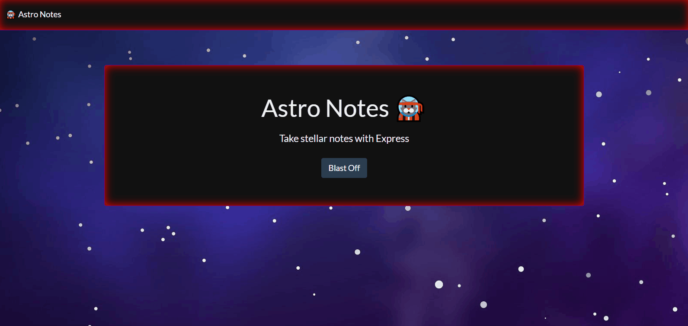

# Astro Notes 🐱‍🚀
An out-of-this-world note-taking app written in NodeJS using Express for stellar server-side performance.

## 📚 Table of Contents
- [Astro Notes ](#Astro-Notes-️)
  - [📚 Table of Contents](#-table-of-contents)
  - [🧾 Features](#-features)
  - [💯 Additional Features](#-additional-features)
  - [📖 Developer Journey](#-developer-journey)
  - [🛠️ Installation](#️-installation)
  - [👨‍🏫 Usage](#-usage)
  - [🥂 Credits](#-credits)
  - [📇 License](#-license)
  - [👋 How to Contribute](#-how-to-contribute)

## 🧾 Features
- Write and save notes
- Helps small business owners organize thoughts
- Keeps track of tasks needing to be completed
- Beautiful landing page with a link to saved notes
- Organized list of notes
- Enter new notes with title and text
- Theme powered by Bootstrap and custom CSS3
- Fonts by Font Awesome
- New notes can be saved to a list
- Saved notes can be retrieved on demand
- Write functionality to empty text area
- Data persists using Express server backend

## 📖 Developer Journey

📓 This is a long description about everything we want to say about creating this project. This should include process and challenges, as well as a thorough telling of technologies used and lessons learned along the way.

🦟 It should be multiple paragraphs long and should include a relevant emoji before each new paragraph. For example, this paragraph is about bugs.

## 🛠️ Installation
Locate the dropdown menu labeled 'Code' to the left of the About section in the main page of this repository. From there, select your preferred cloning method from HTTPS, SSH, or the GitHub CLI. For this demonstration, we will be using the SSH method. Copy the link and head to your terminal. From the command line you should enter:

    git clone <INSERT_SSH_KEY_HERE>

Replacing the above placeholder with the link copied from GitHub. This will clone the repository into a local directory on your machine. And that's it! Happy Hacking! 🚀

## 👨‍🏫 Usage
This code is strictly for use by astro-cats and their respective litters of kittens, but not their kitten litter, kittens' litters, or kittens' litter's kittens and is only provided as material for study and otherwise double-checking implementation of various server-side and back-end functionality such as but not limited to API routes, express servers, node module exports, and other shenanigans. Any violations of these use cases will see the offender sent through the airlock, relegated to an escape pod that will be sent into deep space to drift along a lonely eternity through the endless cosmos. Screenshots of original mockup are included.

   

## 🥂 Credits
UT Austin Coding Boot Camp https://techbootcamps.utexas.edu/coding/

Kyle Ferguson https://github.com/kferguson52

Stack Overflow https://stackoverflow.com/

W3 Schools https://www.w3schools.com/

MDN Web Docs https://developer.mozilla.org/en-US/

## 📇 License
MIT License

Copyright (c) 2022 Keenan R. Chiasson, Andy McAlpin, Jaime Gutierrez, and William Jardell

Permission is hereby granted, free of charge, to any person obtaining a copy
of this software and associated documentation files (the "Software"), to deal
in the Software without restriction, including without limitation the rights
to use, copy, modify, merge, publish, distribute, sublicense, and/or sell
copies of the Software, and to permit persons to whom the Software is
furnished to do so, subject to the following conditions:

The above copyright notice and this permission notice shall be included in all
copies or substantial portions of the Software.

THE SOFTWARE IS PROVIDED "AS IS", WITHOUT WARRANTY OF ANY KIND, EXPRESS OR
IMPLIED, INCLUDING BUT NOT LIMITED TO THE WARRANTIES OF MERCHANTABILITY,
FITNESS FOR A PARTICULAR PURPOSE AND NONINFRINGEMENT. IN NO EVENT SHALL THE
AUTHORS OR COPYRIGHT HOLDERS BE LIABLE FOR ANY CLAIM, DAMAGES OR OTHER
LIABILITY, WHETHER IN AN ACTION OF CONTRACT, TORT OR OTHERWISE, ARISING FROM,
OUT OF OR IN CONNECTION WITH THE SOFTWARE OR THE USE OR OTHER DEALINGS IN THE
SOFTWARE.

## 👋 How to Contribute

See the [Contributor Covenant](https://www.contributor-covenant.org/) for details on how to contribute
